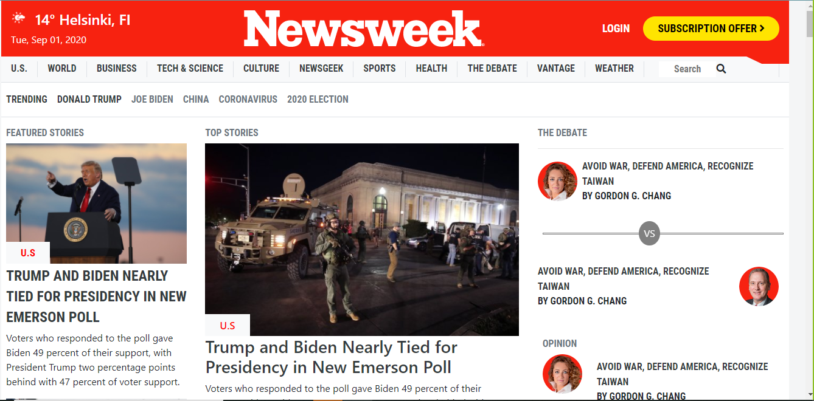

<h1>#Using Bootstrap_Newsweek clone</h1>

This project is a clone of The Newsweek interface. The aim of this project was to recreate The Newsweek design using html,css and bootstrap technologies. Bootstrap was the main framework that was used in building this project.

</h1>Additional description about the project and its features.</h1>

<h2>Built With</h2>

Html

CSS

Bootstrap

Atom editor, Visual code

<h2>Live Demo</h2>

<h2>Getting Started</h2>
To get a local copy up and running follow these simple example steps.

Prerequisites
Text editor,Github profile and Git.

<h2>Authors</h2>

👤 Avijit Karmaker

Github: https://github.com/ajkacca457

Twitter: @ajkacca

Linkedin: https://www.linkedin.com/in/avijit-karmaker-8738a54a/

👤 Ntwali Heritier

Github: https://github.com/NtwaliHeritier)

Twitter: https://twitter.com/NtwaliHeritier)

Linkedin: https://linkedin.com/in/ntwali-heritier-9950001a2

🤝 Contributing
Contributions, issues and feature requests are welcome!

Feel free to check the issues page.

Show your support
Give a ⭐️ if you like this project!

📝 <h2>License</h2>
This project is a collaboration project of microverse students. All rights are reserved for Avijit and Ntwali.
